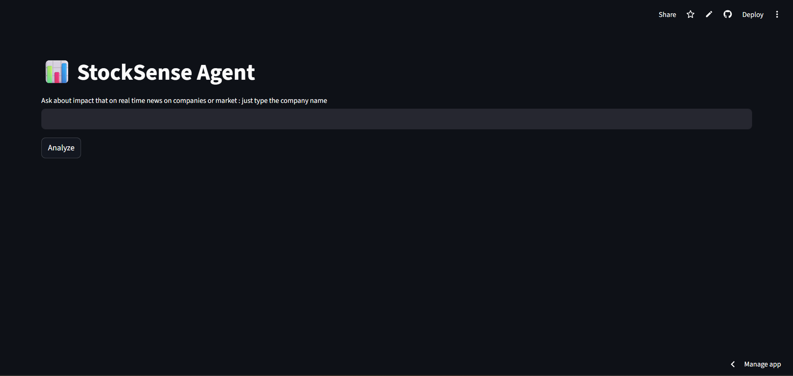
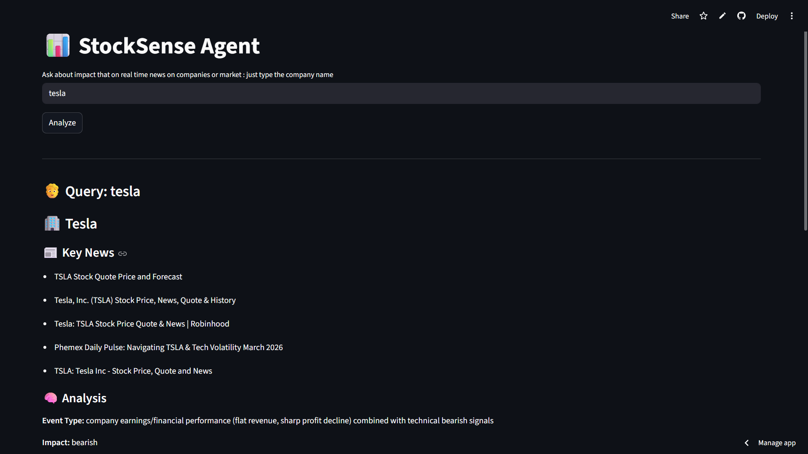

# 🚀 StockSense Agent – Multi-Agent Financial Intelligence System

StockSense Agent is a full-stack Generative AI system that analyzes real-time news and explains its potential impact on stock behavior using a multi-agent architecture.

> ⚠️ This system provides **AI-driven insights, not financial advice or stock price predictions.**

---

## 🌐 Live Demo

🔗 **Live Link:** [Live Link](https://alok-stocksense-agent-123.streamlit.app/)

---

## 🖼️ Screenshots

### 📊 Application Interface



### 🧠 Analysis Output



---

## 🧠 System Overview

StockSense Agent is designed as a **multi-agent pipeline** where each component performs a specific responsibility:

```text
User Query
   ↓
Router Agent (intent + entity extraction)
   ↓
Validation Layer (rule-based + LLM)
   ↓
Orchestrator
   ↓
 ┌───────────────┬───────────────┐
 ↓               ↓               ↓
News Agent    Finance Agent   Memory
 ↓               ↓
      Reasoning Agent (LLM)
               ↓
        Structured Output
               ↓
           Frontend UI
```

---

## 🤖 Agents Description

### 1. 🧭 Router Agent

* Extracts **intent** (news, impact, general)
* Identifies **company names** using LLM + fallback
* Handles vague and multi-company queries

---

### 2. 📰 News Agent

* Fetches real-time news using **Tavily API**
* Filters and structures relevant company news
* Uses caching to reduce API calls

---

### 3. 📊 Finance Agent

* Resolves **company → ticker**
* Fetches stock-related data
* Provides structured financial context

---

### 4. 🧠 Reasoning Agent

* Uses LLM to:

  * Analyze news impact
  * Generate reasoning chain
  * Identify risks
  * Estimate confidence
* Adds deterministic **conclusion layer**

---

### 5. 🛡️ Validation Layer

* Prevents invalid or random inputs
* Hybrid approach:

  * Rule-based filtering
  * LLM-based verification

---

### 6. 🧠 Memory Module

* Stores:

  * last company
  * last query
* Enables **multi-turn conversations**

---

### 7. ⚡ Caching Layer

* Reduces latency and API cost
* TTL-based caching for:

  * news data
  * financial data

---

## 🔄 Data Flow (Step-by-Step)

1. User submits a query via frontend
2. Router Agent extracts intent and company
3. Validation layer filters invalid inputs
4. Orchestrator controls pipeline execution
5. News + Finance agents fetch data
6. Reasoning agent analyzes impact
7. Structured response is returned
8. Frontend renders insights

---

## 📡 API Endpoints

### 🔹 POST `/analyze`

Analyze a company based on real-time news

#### Request:

```json
{
  "query": "Tesla latest news impact",
  "user_id": "user123"
}
```

#### Response:

```json
[
  {
    "company": "Tesla",
    "event_summary": ["News headline..."],
    "event_type": "earnings / macro",
    "impact_direction": "Positive",
    "reasoning_chain": ["Step 1...", "Step 2..."],
    "risks": ["Risk 1...", "Risk 2..."],
    "confidence": "medium",
    "conclusion": "Stock may increase",
    "disclaimer": "This is an AI-generated analysis..."
  }
]
```

---

### 🔹 Error Response

```json
{
  "message": "Please enter a valid company name (e.g., Tesla, Apple)"
}
```

---

## ⚙️ Tech Stack

* **Backend:** FastAPI
* **Frontend:** Streamlit
* **LLM:** OpenAI OSS / Groq
* **Search:** Tavily API
* **Architecture:** Multi-Agent System
* **Deployment:** Render and streamlit cloud

---

## ⚠️ Limitations

* LLM responses may vary
* Not suitable for real financial decision-making
* Dependent on external APIs

---

## 📌 Key Engineering Highlights

* Multi-agent orchestration instead of single LLM call
* Hybrid validation to reduce hallucination
* Deterministic + LLM combined reasoning
* Session-based conversational memory
* Production-style backend/frontend separation

---
